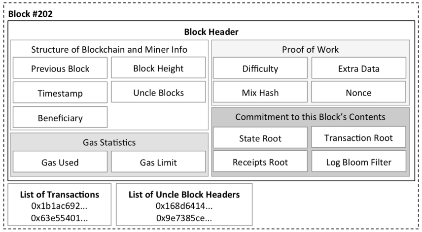
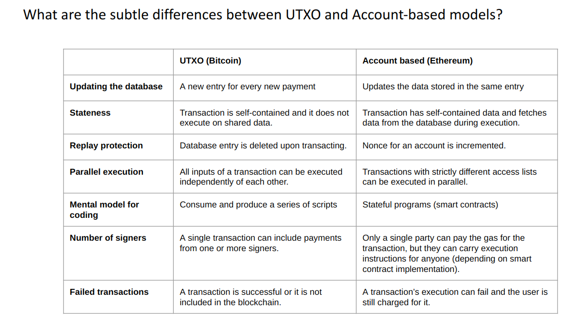

# Basics

### Consensus    
A set of computers want to reach agreement that about a single decision (or data item)

Properties of consensus protocol:
- Safety : Everyone should agree, and never forget.
- Liveness How many peers must be online before a decision is final?
   
Blockchains enable trust engineeering. Define, minimize, and if possible remove trust from intermediaries.
Replace it with public, verifiable and programmable programs (smart contracts).

### Smart Contract

A smart contract is a computerized transaction protocol that executes the terms of a contract. 
The general objectives are to satisfy common contractual conditions (such as payment terms, liens, confidentiality, 
and even enforcement), minimize exceptions both malicious and accidental, and minimize the need 
for trusted intermediaries. (Nick Szabo)

They are computer programs stored on the blockchain that follow "if this then that" logic, and are guaranteed to 
execute according to the rules defined by its code, which cannot be changed once created.

A smart contract will : 
- I will never modify or change your code.
- I will always run the code you tell me too (assuming the code itself allows me!).
- I will never let code execution “stop half way” it is ALL or NOTHING with me.
- I like to gossip and I can’t keep secrets - Everything you tell me will be public knowledge.

### Accounts
- Externally owned accounts: controlled by people/keys
- Contract accounts: controlled by smart contract code + storage

### Transactions (ETH)

- Value Transaction: Transfer coins from an externally owned account to another account
- Creation Transaction: The code of a smart contract is stored in a transaction’s payload and sent to the Blockchain.
- Invocation Transaction: The commands to invoke code in the contract is stored in a transaction’s payload and sent to the Blockchain.

Gas is paid as a unit of comutation for transactions.

### Primitives

#### Hash 
- Pre-image : Input data (Variable)
- Hash : Computed hash of pre-image. (Fixed length)

One-way pseudorandom (and collision-resistant) function h = hash(x)

Properties
- Preimage Resistance : Given a hash value h it should be difficult to find any message m such that h = hash(m).
In other words,the hash h provides “no clues or hints” about the input.
- Second Preimage Resistance : Given an input m1, it should be difficult to find a different input m2 such 
that hash(m1) = hash(m2).
- Collision-Resistance : Basically, there cannot be ANY collisions for ANY pair of messages.

Collision resistance is about the infeasibility of finding two distinct inputs m and m' such that h(m) = h(m'). 
The attacker gets to choose m and m' arbitrarily, as long as he ends up with two distinct messages that hash to the same value.
Second-preimage resistance is very similar except that the attacker does not get to choose m. 
Instead, we give him m, and challenge him with finding m' (distinct from m) such that h(m) = h(m').

A second-preimage is also a collision, but we keep the concept distinct because second-preimages are supposed to be 
substantially harder.

### Public Key Cryptography
Domain parameters (g, q, CURVE, n)
- “g” = Well-known generator
- “n” = Modulus for private key space
- “q” = Modulus for public key space
```
d = RanNum() mod n ← Private Key
g^d = P mod q ← Public Key
```

Sign a message
```σ = Sign(message, sk)```
Verify signed message
```0/1 = Verify(σ, pk, msg)```

Secure random number generators are required!  An ECDSA Signature is denoted:
```
(r,s) => Randomness, Signature
```
Re-using randomness can be detected and is an attack vector.

Bitcoin/Ethereum use the curve Secp256k1 for operations. ( Elliptic Curve Digital Signature Algorithm (ECDSA))
```
y^2 = x^3 + 7 
```


### ETH Block Header


- Transaction Root:  A commitment to the list of transactions.Just like in Bitcoin, there is a commitment for 
all transactions in this block.We can prove a transaction was included in the block using hash and this tree root.
- State Root: A commitment to the entire ledger’s state. or any block, we can prove : Balance of an account and  State 
of a smart contract.
- Recepit Root : A receipt detailing the outcome of a transaction’s execution : Status (did tx fail?), Sender / Receiver,
Gas Used ,Logs (emit events),Useful for watching the progression of a smart contract.

### Light Client/SPV

A light client or light node is a piece of software that connects to full nodes to interact with the blockchain. 
Unlike their full node counterparts, light nodes don’t need to run 24/7 or read and write a lot of 
information on the blockchain. In fact, light clients do not interact directly with the blockchain; 
they instead use full nodes as intermediaries. Light clients rely on full nodes for many operations, 
from requesting the latest headers to asking for the balance of an account.

The way light client protocols are designed allows them to interact with full nodes in a trust-minimized manner.

- “Lightweight clients” store the list of block headers
Discard (or simply do not receive) all transactions.


- Transaction Inclusion Proof:Transaction + Merkle Tree Branch + Block Header


- Weaker Trust assumption.Cannot validate all transactions, assumes chain with most proof of work is correct
“Fraud Proof” is a research direction - prove that a block is invalid.


### UTXO vs Account based Model
An Unspent Transaction Output is “essentially” a single database entry.
Anyone who can satisfy a list of spending conditions can claim the coins.
ETH account based model can be simplified as Rows & colums , where columns would be address, storage trie root,code ,
balance , nonce.




### Hard Fork vs Soft Fork
- Hard Fork : A new consensus rule is publicly detectable by non-upgraded nodes.For example, increasing 
the block size from 1mb to 2mb.Bob must upgrade his node software to follow the new blocks He has an explicit 
choice whether to accept the new consensus rule or not.
- Soft fork : A new consensus rule is NOT publicly detectable by non-upgraded nodes.Assuming the block size is 1MB,
miners all agree to only mine blocks of 500kb.Bob’s node software will accept the new consensus rule, no upgrade required
He has no choice but to follow the new consensus rules.


--- 
References
-  [Introduction to Blockchains](https://pisa.watch/) - [Patrick McRorry](https://twitter.com/stonecoldpat0)
- [Light clients](https://www.parity.io/blog/what-is-a-light-client/)